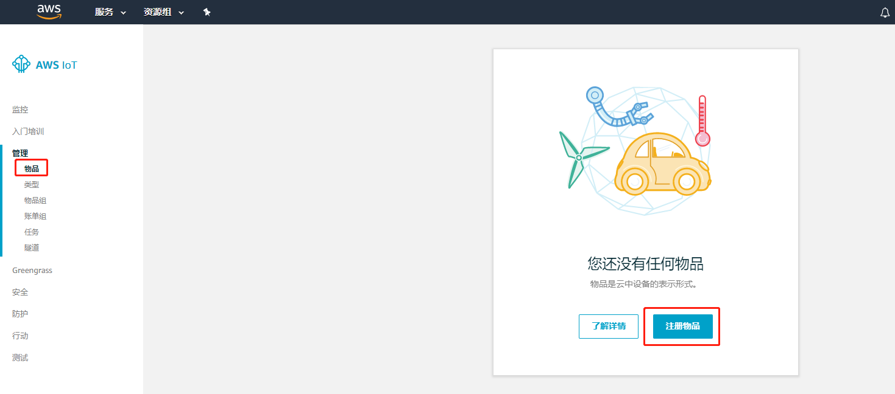
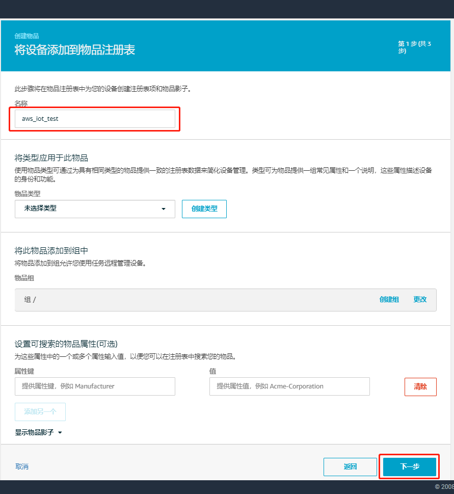
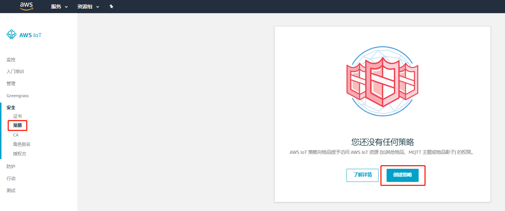
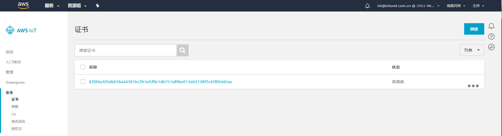

# Data to AWS IoT Example

  - [概述](#overview)
  - [先决条件](#prerequisites)
  - [环境准备](#environmental-preparation)
    - [配置AWS IoT](#configure-aws-iot)
    - [配置开发环境](#configure-the-development-environment)
  - [开始测试](#start-testing)
  - [FAQ](#faq)


<a id="overview"> </a>

## 概述
映翰通提供`aws_iot`示例以便于客户基于InGateway开发上传数据至AWS IoT并接收AWS IoT下发数据的Python App（以下简称App）。该示例主要基于`AWS IoT Device SDK`实现上传数据至AWS IoT以及接收AWS IoT下发的数据，`AWS IoT Device SDK`的详细使用方法请访问[aws-iot-device-sdk-python](https://github.com/aws/aws-iot-device-sdk-python)。 

<a id="prerequisites"> </a>

## 先决条件
在进行开发和测试前，你需要具备以下条件：  
- InGateway  
  - 固件版本：`2.0.0.r12644`及以上（请联系客服获取）  
  - Python3 SDK版本：`1.3.9`及以上（请联系客服获取）    
- VS Code软件   
- AWS IoT账号  

<a id="environmental-preparation"> </a>

## 环境准备

 - [配置AWS IoT](#configure-aws-iot)  
 - [配置开发环境](#configure-the-development-environment)  

<a id="configure-aws-iot"> </a>

### 配置AWS IoT
如果你已经在AWS IoT上完成了“物品”、“证书”和“策略”的配置，可以跳过这一小节。
- 步骤1：登录AWS IoT   

  访问<https://aws.amazon.com/>登录AWS。  

    

- 步骤2：进入IoT Core  
  
  登录成功后点击“物联网 > IoT Core”进入“AWS IoT”。  

    

  进入“AWS IoT”后页面如下图所示：  

    

- 步骤3：创建物品  

  选择“管理 > 物品”进入“物品”页面点击“注册物品”或“创建”以创建物品。  

    

  选择“创建单个物品”。  
  
    
  
  随后为物品设置名称，如`aws_iot_test`，其余项使用默认配置即可，配置完成后点击“下一步”。  

    
  
  点击“创建证书”。  

    

<a id="download-file"> </a> 

  证书创建完成后需要下载物品的证书和私有秘钥并激活证书，之后点击“完成”以完成创建物品。
  
    
  
  物品创建成功后如下图所示：  
  
    

- 步骤4：创建策略  
  
  选择“安全 > 策略”进入“策略”页面点击“创建策略”或“创建”以创建策略。  

    

  在“创建策略”页面输入策略名称并参考下列配置来配置策略（该策略使所有客户端都能连接到AWS IoT），配置完成后点击“创建”完成策略创建。  
  - “操作”中填入`iot:*`  
  - “资源ARN”中填入`*`  
  - “效果”选择“允许”  

    
  
  策略创建成功后如下图所示：  

    
  
- 步骤5：配置证书  
  
  选择“安全 > 证书”进入“证书”页面，如下图所示：  

    

  - 附加策略  

    点击证书右侧的“。。。”并选择“附加策略”为证书附加策略。  

      
    
    随后选择相应的策略并点击“附加”。  

      

    策略附件成功如下图所示：  

    
 
  - 附加物品  
  
    点击证书右侧的“。。。”并选择“附加物品”为证书附加物品。  

      

    随后选择相应的物品并点击“附加”。  
    
      
    
    物品附加成功如下图所示：  

      

至此，完成了AWS IoT环境准备。

<a id="configure-the-development-environment"> </a>

### 配置开发环境

<a id="prepare-the-development-environment"> </a>   

- 准备开发环境  

  设备联网、软件更新、IDE软件获取等基础的配置操作请查看[MobiusPi Python Development Quick Start](http://sdk.ig.inhand.com.cn/zh_CN/latest/MobiusPi%20Python%20QuickStart-CN.html)。以下操作我们将假设你已经完成了InGateway的软件更新、设备联网、开启调试模式等配置。  

<a id="create-project-folder"> </a>  

- 建立项目文件夹  

  建立一个项目文件夹，最终项目文件夹的结构如下（除创建物品时下载的证书和私有秘钥外，其余项均可从[InGateway-Python-Examples](https://github.com/inhandnet/InGateway-Python-Examples)下载）：
  ```
  ├── .vscode
  │  └── sftp.json
  ├── build
  ├── lib
  ├── src
  │  │── 626f4a303d-certificate.pem.crt
  │  │── 626f4a303d-private.pem.key
  │  │── aws_iot_mqtt_client_example.py
  │  │── main.py
  │  └── rootca.crt
  └── setup.py
  ```
  - `.vscode`：VS Code配置文件夹  
    - `sftp.json`：与InGateway建立SFTP连接所需的SFTP配置文件。  
  - `build`：App发布包文件夹。  
  - `lib`：App第三方依赖库文件夹。  
  - `src`：App源码文件夹  
    - `626f4a303d-certificate.pem.crt`：创建物品时下载的证书，见[下载证书和秘钥](#download-file)。  
    - `626f4a303d-private.pem.key`：创建物品时下载的私有秘钥，见[下载证书和秘钥](#download-file)。  
    - `aws_iot_mqtt_client_example.py`：主要基于`AWS IoT Device SDK`实现上传数据至AWS IoT以及接收AWS IoT下发的数据。  
    - `main.py`：App入口。  
    - `arootca.crt`：连接AWS IoT所需的证书文件，直接使用即可，无需修改。  
  - `setup.py`：App说明文件。  

<a id="start-testing"> </a>

## 开始测试

- [安装Azure IoT SDK](#install-azure-iot-sdk)   
- [修改代码](#modify-the-code)  
- [调试代码](#debug-code)
- [在AWS IoT中查看上报数据](#view-reported-data)  
- [在AWS IoT中下发数据](#send-data)  

<a id="install-azure-iot-sdk"> </a> 

- 步骤1：安装AWS IoT Device SDK  

  建立与InGateway的SFTP连接，操作步骤见[建立SFTP连接](http://sdk.ig.inhand.com.cn/zh_CN/latest/MobiusPi%20Python%20QuickStart-CN.html#sftp)。SFTP连接建立成功后，在左侧空白处右键选择“Sync Local->Remote”将代码同步到InGateway。  

  

  同步成功后，在“终端”中输入`pip install AWSIoTPythonSDK --user`命令为App安装AWS IoT Device SDK依赖库<font color=#FF0000>(安装前请确认InGateway已经联网成功)</font>。

    

  安装完成后如下图所示：  

    

<a id="modify-the-code"> </a>  

- 步骤2：修改代码   

  使用VS Code打开项目文件夹，选中`aws_iot_mqtt_client_example.py`，根据你的实际情况修改脚本中的以下参数：  

    

  - 参数1：AWS IoTMQTT客户端ID，输入任意唯一ID即可。  
  - 参数2：AWS IoT的hostname，你可以从AWS IoT的“设置”页面复制该参数，如下图所示：  

      

  - 参数3：物品的私钥文件名称。  
  - 参数4：物品的证书文件名称。

<a id="debug-code"> </a>  

- 步骤3：调试代码  

  如何使用VS Code调试代码请参考[调试代码](http://sdk.ig.inhand.com.cn/zh_CN/latest/MobiusPi%20Python%20QuickStart-CN.html#id13)。
  
  `main.py`的运行结果如下图所示：  
  
    

    
  
<a id="view-reported-data"> </a>

- 步骤4：在AWS IoT中查看上报数据  

  在AWS IoT“测试”页面的“订阅主题”中输入`aws_iot_mqtt_client_example.py`中的`pub_topic`参数，默认为`data/published/by/client`，其余项使用默认配置即可。配置完成后点击“订阅主题”。  

    

    

  随后可在相应的主题中看到AWS IoT接收到的数据。  

    

<a id="send-data"> </a>

- 步骤5：在AWS IoT中下发数据  

  在AWS IoT“测试”页面的“发布主题”中输入`myAWSIoTMQTTClient.subscribe`方法的第一个参数，默认为`sdk/test`。配置完成后点击“发布到主题”。  

  
  
  随后在“终端”窗口中可以查看接收到的下发数据。  

    

至此，完成了上传数据至AWS IoT并接收AWS IoT下发的数据。

## FAQ
- Q1：运行时提示“证书认证失败”（[SSL: CERTIFICATE_VERIFY_FAILED]），如何解决？   

    

  A1：检查`aws_iot_mqtt_client_example.py`中的“hostName”参数中是否有`-ats`。如果有`-ats`，则删除后重试。