# Data to Azure IoT Hub Example

 - [概述](#概述)
 - [先决条件](#先决条件)
 - [环境准备](#环境准备)
 - [开始测试](#开始测试)

## 概述
映翰通提供`azure_iot_device`示例以便于客户基于InGateway二次开发实现上传数据至Azure IoT Hub并接收Azure IoT Hub下发的数据。示例包含以下内容：  
- `azure_iot_device/iothub_client_example`：主要基于`Azure IoT Device SDK`实现上传数据至Azure IoT Hub以及接收Azure IoT Hub下发的数据，`Azure IoT Device SDK`的详细使用方法请访问[azure-iot-sdk-python](https://github.com/Azure/azure-iot-sdk-python/tree/master/azure-iot-device)。  
- `azure_iot_device/iothub_client_cert`：连接Azure IoT所需的证书脚本，直接使用即可，无需修改。
- `azure_iot_device/sftp.json`：用于连接InGateway的SFTP配置文件。

## 先决条件
在进行开发和测试前，你需要具备以下条件：  
- InGateway  
  - 固件版本：`2.0.0.r12191`及以上  
  - SDK版本：`1.3.4`及以上  
- VS Code软件   
- Azure IoT账号  

## 环境准备

 - [配置Azure IoT](#配置azure-iot)  
 - [配置开发环境](#配置开发环境)  

### 配置Azure IoT
如果你已经在Azure IoT上配置了相应的IoT Hub和IoT device，可以跳过这一小节。
- 步骤1：登录Azure IoT  
访问<https://portal.azure.cn/>登录Azure。  

    

- 步骤2：添加IoT Hub  
登录成功后如下图所示，选择“IoT Hub”。  

    

  点击“Add”创建一个IoT Hub。  

    

    

  创建成功后如下图所示：  

    

- 步骤3: 添加IoT Device  
在IoT Hub中创建一个IoT Device。  

    

    

    

  创建成功后如下图所示：  

  

### 配置开发环境  
- [InGateway配置](#gateway-configuration)  
- [建立项目文件夹](#create-project-folder)  
- [在VS Code中安装Azure IoT Tools插件](#install-azure-iot-tools-plugin)  
- [安装Azure IoT SDK](#install-azure-iot-sdk)  

   

- InGateway配置  
设备联网、软件更新、IDE软件获取等基础的配置操作请查看[MobiusPi Python Development Quick Start](http://doc.ig.inhand.com.cn/zh_CN/latest/QuickStart.html)。以下操作我们将假设你已经完成了InGateway的软件更新、设备联网、开启调试模式等配置。  

  

- 建立项目文件夹  
建立一个“Demo test”文件夹作为项目文件夹，将从[InGateway-Python-Examples](https://github.com/inhandnet/InGateway-Python-Examples)下载的`iothub_client_example.py`、`iothub_client_cert.py`和`sftp.json`放入项目文件夹中。    

  

- 在VS Code中安装Azure IoT Tools插件  
在VS Code中点击“Extensions”，在搜索框中输入`Azure IoT Tools`并安装`Azure IoT Tools`插件。  

    

  安装成功后在左侧可以看到`Azure`模块。  

    

 

- 安装Azure IoT SDK  
使用VS Code打开项目文件夹，在“命令面板”中输入`>SFTP:Config` 命令打开`sftp.json`文件。  

  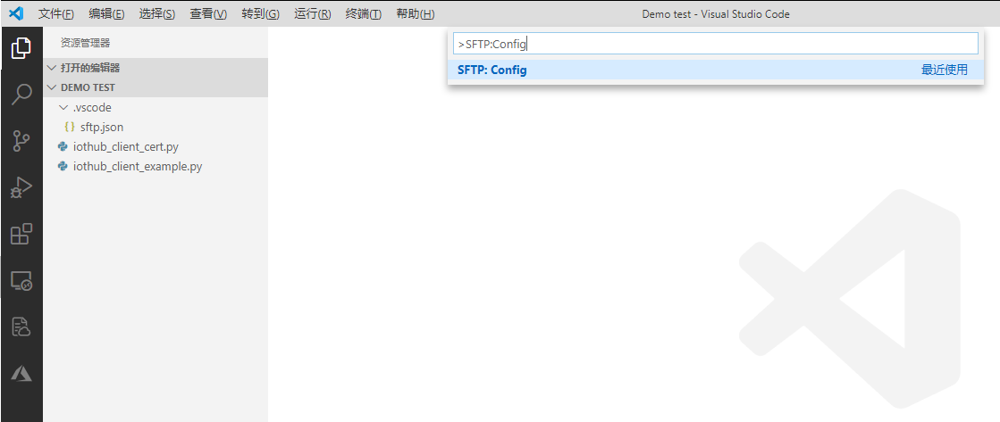  

  配置`sftp.json`文件，配置方法见[建立SFTP连接](http://doc.ig.inhand.com.cn/zh_CN/latest/QuickStart.html#sftp)。  

  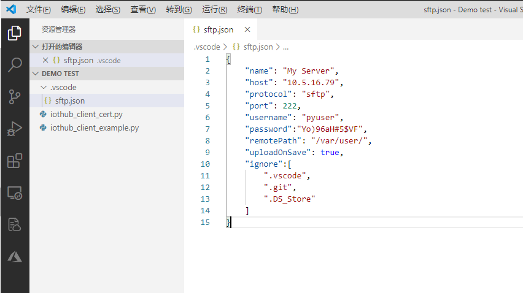  

  配置完成并保存后在“命令面板”中输入`>SFTP:Open SSH in Terminal`以连接InGateway。  

  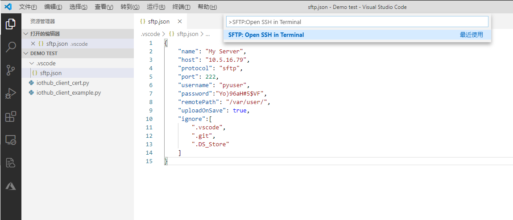  

  输入后命令面板会提示你需要输入SFTP服务器的IP地址（即“host”项内容）。  

  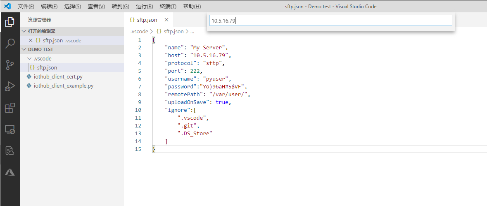  

  “终端”窗口会提示你需要输入密码，你只需要将`sftp.json`文件中“password”项复制粘贴到此处即可。  

  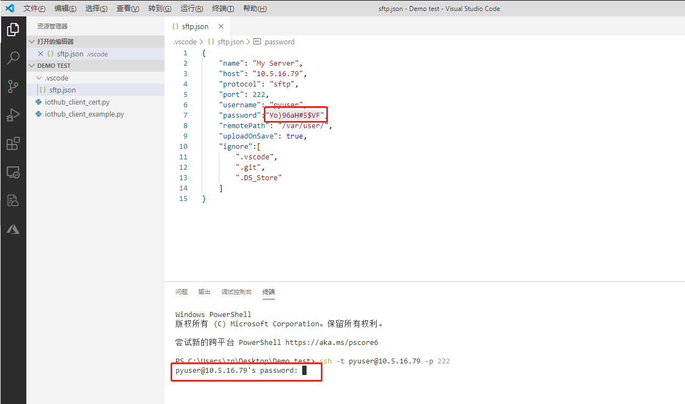  

  成功与InGateway建立SFTP连接后如下图所示：  

  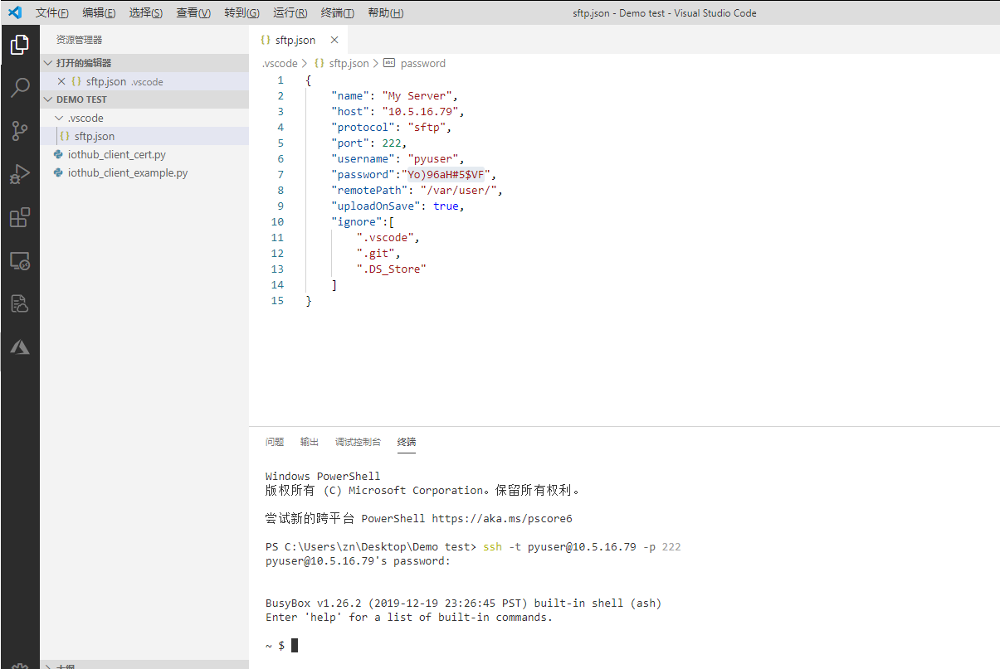  

  在“终端”中输入`pip install azure-iot-device --user`命令以安装Azure IoT SDK。(安装前请确认InGateway已经联网成功)   

  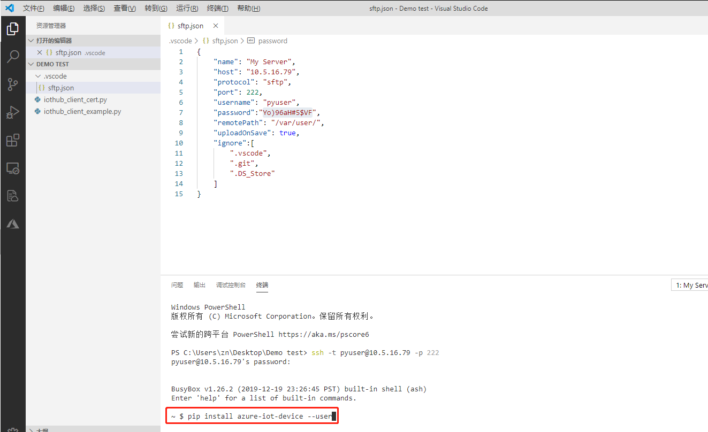  

  安装完成后如下图所示：  

    

## 开始测试  
- [配置iothub_client_example.py](#configuration-iothub-client-example)  
- [使用Azure IoT Tools查看上报数据](#view-reported-data)  
- [使用Azure IoT Tools下发数据](#send-data)  

 

- 步骤1：配置`iothub_client_example.py`  
在VS Code中打开项目文件夹并选中`iothub_client_example.py`，根据你的实际情况修改脚本中的`CONNECTION_STRING`参数。  

  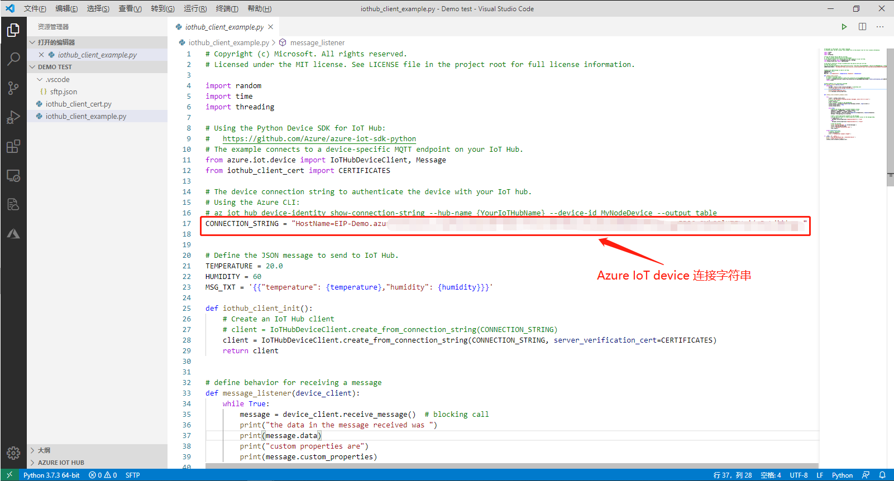  

- 步骤2：使用Azure IoT Tools查看上报数据  
建立与InGateway的SFTP连接并运行`iothub_client_example.py`  

  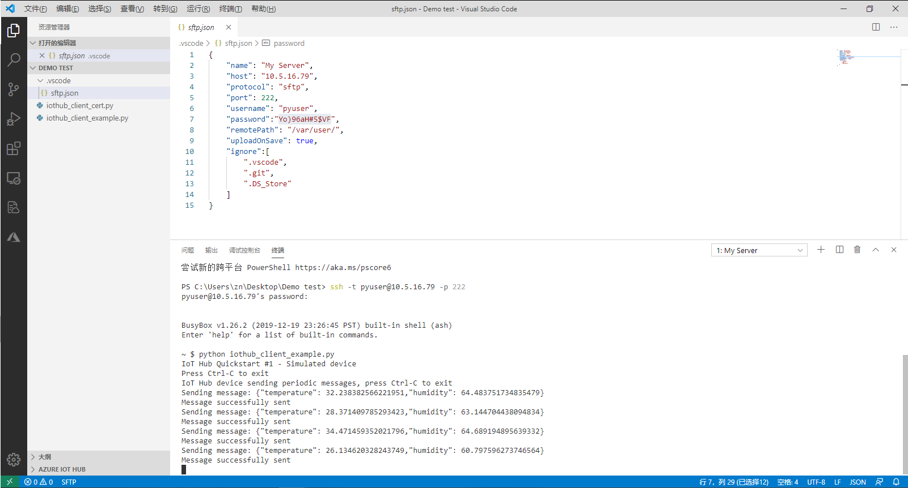  

  在“AZURE IOT HUB”模块中设置IoT Hub的连接字符串以建立与IoT Hub的连接。  

  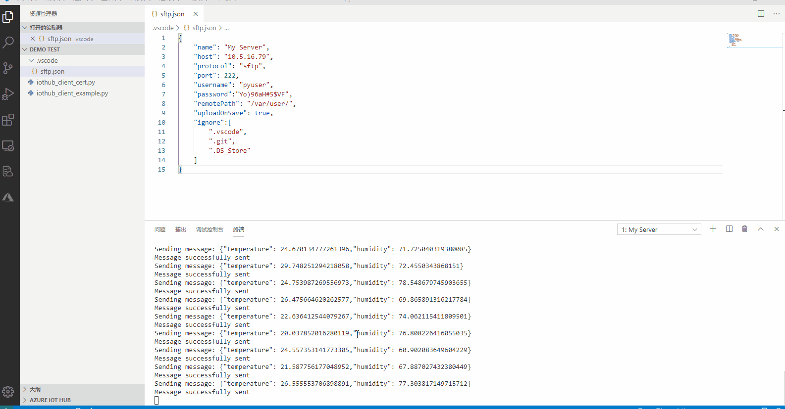  
    
  随后会提示你输入IoT Hub Connetion String（IoT Hub连接字符串）。  

  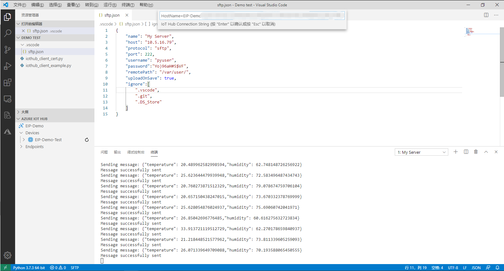  

  IoT Hub连接字符串可从“Azure IoT Hub”页面复制。  

    

  输入IoT Hub Connetion String后可以看到该IoT Hub下的“IoT Device”且状态为Connected。  

  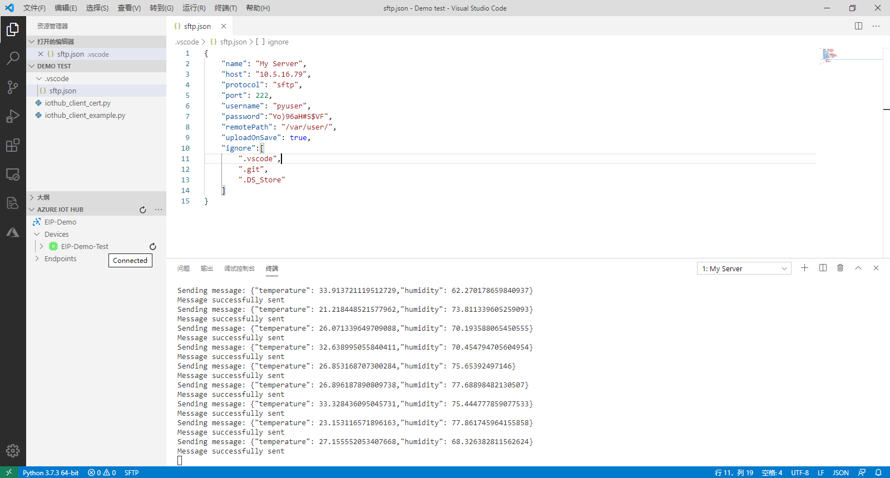  

  右击“IoT Device”并在菜单中选择`Start Monitoring Built-in Event Endpoint`以查看InGateway推送到IoT Hub的数据。  

  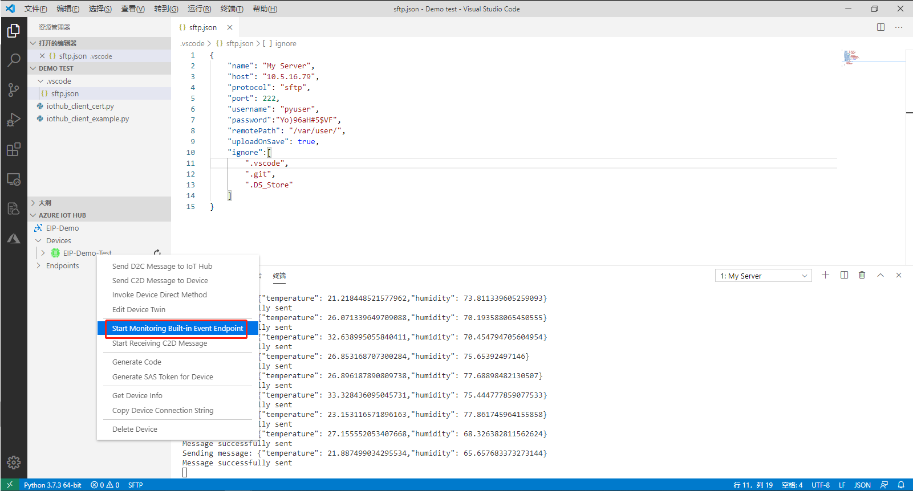  

  随后在“输出”窗口可以查看IoT Hub接收到的数据。  

    

- 步骤3：使用Azure IoT Tools下发数据  
右击“IoT Device”并在菜单中选择`Send C2D Message to Device`以下发数据至InGateway。  

  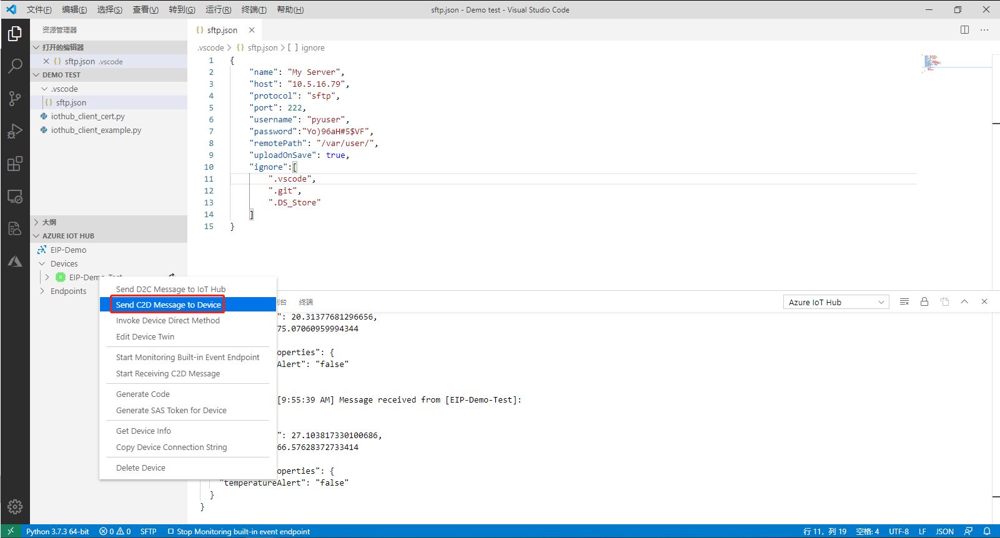  

  在下发框中输入需要下发的数据，如`{"temperature": 27,"humidity": 66}`  

  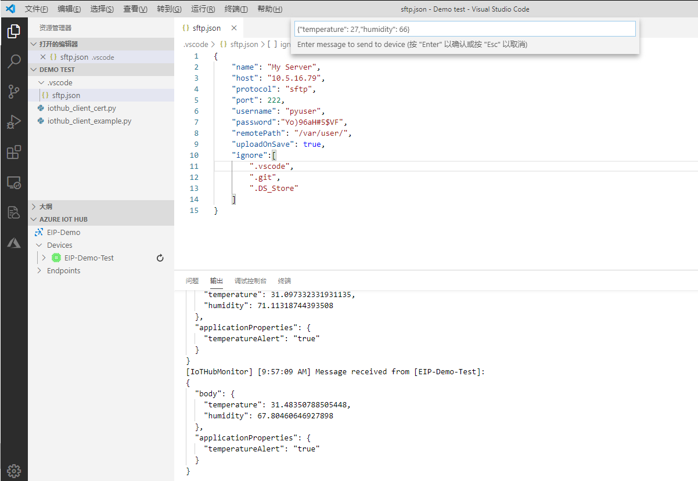  

  在“输出”窗口出现下图所示日志说明数据下发成功：  

  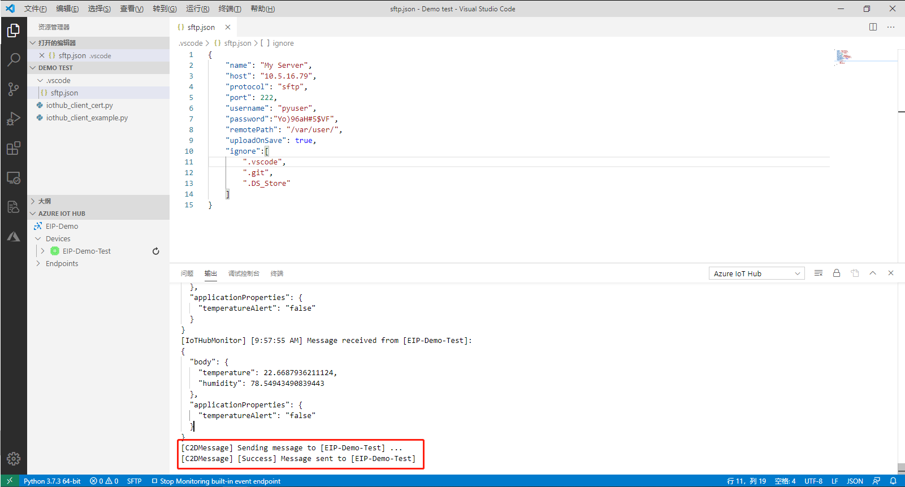  

  随后可在“终端”中查看InGateway接收到的下发数据。  

  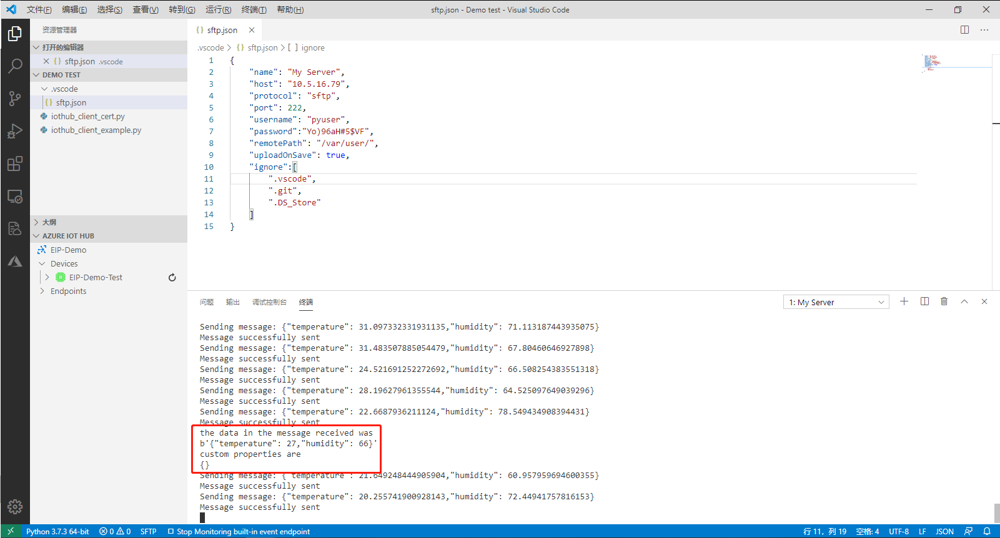  
  

至此，完成了上传数据至Azure IoT Hub并接收Azure IoT Hub下发的数据。

## FAQ
Q1：脚本运行一段时间后，数据无法上传至Azure IoT Hub了。  
A1：请检查与Azure IoT Hub的连接是否正常，当上报消息超过8000条时可能会导致无法正常上报数据。
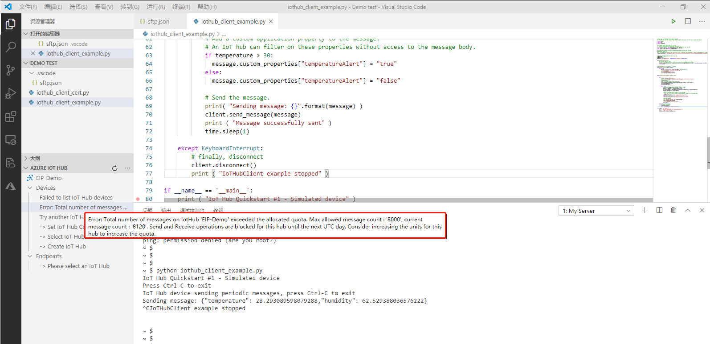