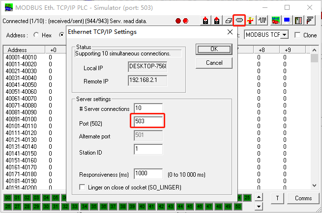
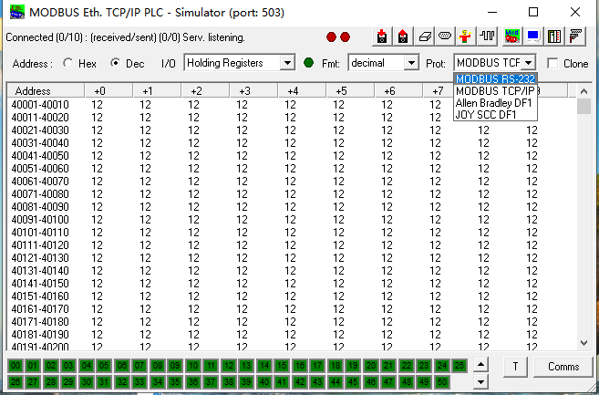
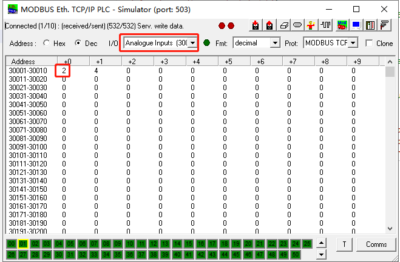

# Modbus Example

  - [概述](#overview)
  - [先决条件](#prerequisites)
  - [环境准备](#environment-preparation)
    - [配置Modbus模拟器](#configuring-the-modbus-simulator)
    - [配置开发环境](#configuring-the-development-environment)
  - [验证数据读写](#test-procedure)

<a id="overview"> </a>  

## 概述
Modbus是master/slave架构的串行通信协议，允许多个设备连接在同一个网络上进行通信。Modbus已经成为工业领域通信协议事实上的业界标准，并且现在是工业电子设备之间常用的连接方式。Modbus比其他通信协议使用的更广泛的主要原因有：
1. 公开发表并且无著作权要求
2. 易于部署和维护
3. 对供应商来说，修改移动本地的比特或字节没有很多限制
 
映翰通提供`modbus`示例以便于客户基于InGateway二次开发实现Modbus数据采集。该示例主要基于`modbus_tk`实现了InGateway作为Modbus master通过Modbus TCP和Modbus RTU协议读写Modbus slave的01、02、03和04功能码的Modbus变量，支持的变量类型包括bit、word、string等数据类型。`modbus_tk`的详细使用方法请访问[modbus_tk](https://github.com/ljean/modbus-tk/)。  <font color=#FF0000>注意：请勿同时运行`device_supervisor app`和`demo示例`，否则可能导致代码运行异常。</font> 

<a id="prerequisites"> </a>  

## 先决条件
在进行开发和测试前，你需要具备以下条件：  
- InGateway  
  - 固件版本
    - IG902：`IG9-V2.0.0.r12644`及以上（请联系客服获取）  
    - IG501：`IG5-V2.0.0.r12884`及以上（请联系客服获取）
  - Python3 SDK版本
    - IG902：`py3sdk-V1.3.9_Edge-IG9`及以上（请联系客服获取）    
    - IG501：`py3sdk-V1.3.9_Edge-IG5`及以上（请联系客服获取） 
- VS Code软件   
- Modbus模拟软件或Modbus PLC（本文档使用Modbus模拟软件`mod_RSsim`进行说明，你可以访问 https://sourceforge.net/projects/modrssim2/ 下载该模拟器软件）  

<a id="environment-preparation"> </a>  

## 环境准备

 - [配置Modbus模拟器](#configuring-the-modbus-simulator)  
 - [配置开发环境](#configuring-the-development-environment)  

<a id="configuring-the-modbus-simulator"> </a>  

### 配置Modbus模拟器
如果你已经配置了相应的Modbus slave，可以跳过这一小节。以下将说明如何配置PC上的Modbus模拟软件`mod_RSsim`以便于后续测试验证。
- 步骤1：建立InGateway与PC的Modbus连接  
  - Modbus TCP：使用以太网线连接PC与InGateway  
  
    设置PC与InGateway处于同一网段（IG501的FE 0/1口的默认ip地址为`192.168.1.1`；IG902的GE 0/2口的默认ip地址为`192.168.2.1`）  
    - 方法一：自动获取IP地址（推荐）  

         

    - 方法二：使用固定IP地址  
  
      选择“使用下面的IP地址”，输入IP地址、子网掩码、默认网关以及DNS服务器地址，单击<确定>。（本demo中配置PC的ip地址为`192.168.2.10`）  

         

  - Modbus RTU：使用USB转串口线连接PC与InGateway  

    IG902串口端子接线说明如下图：  
    
      

    IG501串口端子接线说明如下图：  

    


- 步骤2：配置`mod_RSsim`软件  
  - Modbus TCP  

    运行PC上的`mod_RSsim`软件并选择协议为`MODBUS TCP/IP`，该协议支持与Modbus主站进行Modbus TCP协议通讯。  

      
  
    点击通讯参数配置按钮以配置相应的TCP通讯参数，本文档将通讯端口号配置为`503`。  

      

  - Modbus RTU  
  
    运行PC上的`mod_RSsim`软件并选择协议为`MODBUS RS-232`，该协议支持与Modbus主站进行Modbus RTU协议(RS232或RS485串口均可)。  

      

    配置相应的RTU通讯参数，该通讯参数需与`modbus_example.py`中的modbus参数一致，见[修改Modbus slave参数](#modify-the-code)。  

      

<a id="configuring-the-development-environment"> </a>  

### 配置开发环境   

<a id="prepare-the-development-environment"> </a>   

- 准备开发环境  

  InGateway联网、软件更新、IDE软件获取等基础的配置操作请查看[MobiusPi Python Development Quick Start](http://sdk.ig.inhand.com.cn/zh_CN/latest/MobiusPi%20Python%20QuickStart-CN.html)。以下操作我们将假设你已经完成了InGateway的软件更新、设备联网、开启调试模式等配置。  

<a id="create-project-folder"> </a>  

- 建立项目文件夹  

  建立一个项目文件夹，最终项目文件夹的结构如下：
  ```
  ├── .vscode
  │  └── sftp.json
  ├── build
  ├── lib
  ├── src
  │  │── main.py
  │  └── modbus_example.py
  └── setup.py
  ```

  - `.vscode`：VS Code配置文件夹  
    - `sftp.json`：与InGateway建立SFTP连接所需的SFTP配置文件。  
  - `build`：App发布包文件夹。  
  - `lib`：App第三方依赖库文件夹。  
  - `src`：App源码文件夹  
    - `main.py`：App入口。  
    - `modbus_example.py`：主要基于`modbus_tk`实现了InGateway作为Modbus master通过Modbus TCP和Modbus RTU协议读取/写入Modbus slave的01、02、03和04功能码的Modbus变量。  
  - `setup.py`：App说明文件。  

<a id="test-procedure"> </a>  
  
## 验证数据读写
- [安装modbus_tk](#installation-modbus-tk)  
- [修改Modbus slave参数](#modify-the-code)  
- [调试代码](#debug-code)  
- [在mod_RSsim上核对数据读写](#check-read-write-data-on-modrssim)  

<a id="installation-modbus-tk"> </a>  

- 步骤1：安装`modbus_tk`  

  建立与InGateway的SFTP连接，操作步骤见[建立SFTP连接](http://sdk.ig.inhand.com.cn/zh_CN/latest/MobiusPi%20Python%20QuickStart-CN.html#sftp)。SFTP连接建立成功后在终端执行`pip install modbus_tk --user`安装`modbus_tk`依赖库。  

    

  安装成功后如下图所示：
  
  

<a id="modify-the-code"> </a> 

- 步骤2：修改Modbus slave参数  

  本demo的默认配置为使用`Modbus TCP`协议采集IP地址为`192.168.2.10`，端口号为`503`，从站地址为`1`，字节序为`cdab`，超时时间`15`秒的Modbus slave中的以下变量数据：
    1. 读取寄存器地址为`1`的`bit`类型的modbus数据并写入数值`0`，数据名称为`power`
    2. 读取寄存器地址为`30001`的`bit`类型的modbus数据的第二位，数据名称为`model`
    3. 读取寄存器地址为`40001`的`word`类型的modbus数据并写入数值`20`，数据名称为`speed`
    4. 从寄存器地址`40003`开始读取`4`个`string`类型的modbus数据并依次写入字符串`cvbn`，数据名称为`pressure`  

  如果你使用`mod_RSsim`模拟器或者你的PLC上中配置了以上modbus地址变量，则可以直接使用demo代码。否则请在`modbus_example.py`中根据你的实际情况调整以下配置：  

    
 
  - `mbProto`（Modbus TCP）  
    - `reconnect_interval`：超时时间  
    - `hostname`：Modbus模拟器或PLC的ip地址  
    - `type`：通讯类型，以太网通讯时为`TCP`  
    - `port`：通讯端口号  
    - `slave`：站地址  
    - `byte_order`：字节序，包括`abcd`、`badc`、`cdab`、`dcba`四种  
  - `mbProto`（Modbus RTU）  
    - `type`：通讯类型，串口通讯时为`RTU`   
    - `serialPort`：串口号，使用RS485串口时为`/dev/tty03`；使用RS232串口时为`/dev/ttyO1`  
    - `baudrate`：波特率  
    - `bytesize`：数据位  
    - `parity`：校验位，无校验为`N` 、偶校验为`E`、奇校验为`O` 
    - `stopbits`：停止位  
    - `slave`：站地址  
    - `byte_order`：字节序，包括`abcd`、`badc`、`cdab`、`dcba`四种  
  - `mbVal`  
    - `addr`：modbus寄存器地址
    - `operation`：可读可写`rw`、只读`ro`、只写`wo`
    - `len`：读写的数据长度,仅对`string`数据类型有效
    - `name`：数据名称
    - `data_type`：数据类型
    - `register_bit`：03和04功能码数据的数据类型为`bit`或`bool`时，通过此项参数设置读取寄存器地址的哪一位。可配置`0-15`中的任意一位
    - `write_value`：当数据可写时，写入该modbus寄存器地址的数值
   
<a id="debug-code"> </a>  

- 步骤3：调试代码   

  如何使用VS Code调试代码请参考[调试代码](http://sdk.ig.inhand.com.cn/zh_CN/latest/MobiusPi%20Python%20QuickStart-CN.html#id13)。`main.py`运行结果如下图所示：  
  
    

<a id="check-read-write-data-on-modrssim"> </a> 

- 步骤4：在`mod_RSsim`上核对数据读写  

  在`mod_RSsim`的`I/O`项中选择`Coil Outputs`，查看寄存器地址`1`的数据值为0，与`power`数据值一致。  

    

  在`mod_RSsim`的`I/O`项中选择`Analogue Inputs`，查看寄存器地址`30001`第二位的数据值为1，与`model`数据值一致。  

  
  
  在`mod_RSsim`的`I/O`项中选择`Holding Registers`，查看寄存器地址`40001`的数据值为20，与`speed`写入的数据值一致。
  
    

  在`mod_RSsim`的`Fmt`项中选择`char string`，查看寄存器地址`40003-40004`数据值为cvbn，与`pressure`写入的数据值一致。  

  

至此，完成了在InGateway上实现modbus数据采集的开发。