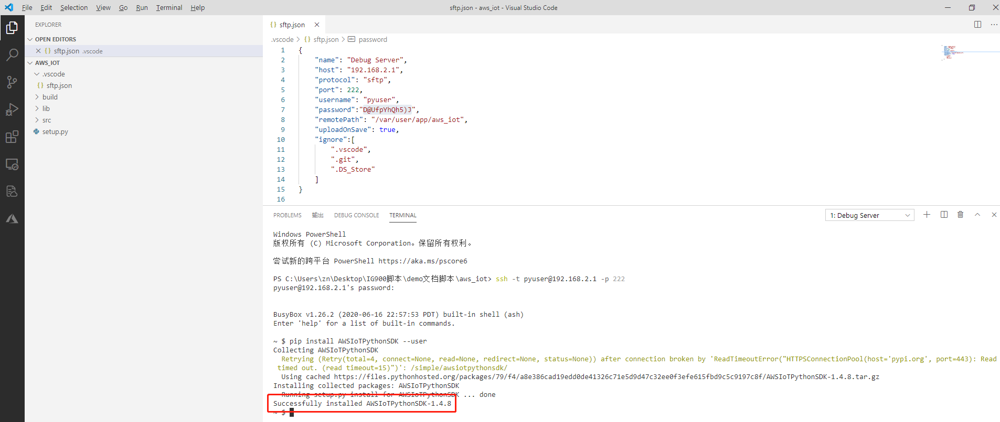

# Data to AWS IoT Example

  - [Overview](#overview)
  - [Prerequisites](#prerequisites)
  - [Environment Preparation](#environmental-preparation)
    - [Configuring AWS IoT](#configure-aws-iot)
    - [Configuring the development environment](#configure-the-development-environment)
  - [Test Procedure](#test-procedure)
  - [FAQ](#faq)

<a id="overview"> </a>

## Overview
InHand Networks provides the `aws_iot` example so that you can conveniently develop a Python App (referred to as App hereinafter) based on the InGateway to upload data to AWS IoT and receive data from AWS IoT. The example is mainly based on the `AWS IoT Device SDK` to upload data to AWS IoT and receive data from AWS IoT. For detailed usage of the `AWS IoT Device SDK`, please visit [aws-iot-device-sdk-python](https://github.com/aws/aws-iot-device-sdk-python).

<a id="prerequisites"> </a>

## Prerequisites
Before starting development and the test, ensure that you get the following items ready:

- InGateway
  - Firmware version: `2.0.0.r12644` or later (Contact the customer service to obtain the firmware file.)
  - Python3 SDK version: `1.3.9` or later (Contact the customer service to obtain this SDK.)
- VS Code software
- AWS IoT account  

<a id="environmental-preparation"> </a>

## Environment Preparation

 - [Configuring AWS IoT](#configure-aws-iot)  
 - [Configuring the development environment](#configure-the-development-environment)  

<a id="configure-aws-iot"> </a>

### Configuring AWS IoT

If you have already configured the thing, certificate, and policy information on AWS IoT, skip this section. 

- Step 1: Log in to AWS IoT.  
  
  Visit <https://aws.amazon.com/> to log in to the AWS.
  
  

- Step 2: Go to IoT Core.  
  
  After the successful login, choose **Internet of Things > IoT Core** to go to the **AWS IoT** page.
  
  
  
  The **AWS IoT** page is displayed as follows:
  
  

- Step 3: Create a thing.  
  
  Choose **Manage > Things**. On the **Things** page, click **Create**.
  
  
  
  Select **Create a single thing**.
  
  
  
  Set the name for the thing, such as `aws_iot_test`, retain the default settings for other parameters, and click **Next**.
  
  
  
  Click **Create certificate**.
  
  

<a id="download-file"> </a>

After the certificate is created, you need to download the certificate for this thing and the private key, activate the certificate, and click **Done**.


After the thing is created, the page is as follows:


- Step 4: Create a policy.  
  
  Choose **Secure > Policies**. On the **Policies** page, click **Create**.
  
  
  
  On the **Create a policy** page, enter the policy name, configure the policy by referring to the following settings, and click **Create**. This policy allows all clients to connect to AWS IoT.
  
  - In the **Action** text box, enter `iot:*`.
  - In the **Resource ARN** text box, enter `*`.
  - Set **Effect** to **Allow**.
  
  
  
  After the policy is created, the page is as follows:
  
  

- Step 5: Configure a certificate.  
  
  Choose **Secure > Certificates** to go to the **Certificates** page, as shown in the figure below.
  
  
  
  - Attach an policy.  

    Click **...** on the right of the target certificate. Select **Attach policy** to attach a policy to the certificate.
    
    
    
    Select the policy that you previously created, and click **Attach**.
    
    
    
    After the policy is attached, the page is as follows:
    
    
  
  - Attach a thing.  
    
    Click **...** on the right of the target certificate. Select **Attach thing** to attach a thing to the certificate.
    
    
    
    Select the thing that you previously created, and click **Attach**.
    
    
    
    After the thing is attached, the page is as follows:
    
    

By now, preparation of the AWS IoT environment is completed.

<a id="configure-the-development-environment"> </a>

### Configuring the development environment

<a id="prepare-the-development-environment"> </a>   

- Prepare the development environment  

  For details about how to connect the device to the Internet, update the software, and obtain the IDE software, see [MobiusPi Python Development Quick Start](http://sdk.ig.inhandnetworks.com/en/latest/MobiusPi%20Python%20QuickStart-EN.html). In the following operations, it is assumed that you have updated the InGateway software, connected the device to the Internet, and enabled the debug mode.

<a id="create-project-folder"> </a>  

- Creating a project folder  

  Create a folder as the project folder. The final structure of the project folder is as follows (In addition to the certificate and private key downloaded when creating the Thing, the rest can be downloaded from [InGateway-Python-Examples](https://github.com/inhandnet/InGateway-Python-Examples)):  
  ```
  ├── .vscode
  │  └── sftp.json
  ├── build
  ├── lib
  ├── src
  │  │── 626f4a303d-certificate.pem.crt
  │  │── 626f4a303d-private.pem.key
  │  │── aws_iot_mqtt_client_example.py
  │  │── main.py
  │  └── rootca.crt
  └── setup.py
  ```
  - `.vscode`：VS Code configuration folder  
    - `sftp.json`：SFTP configuration file used to connect to the InGateway.  
  - `build`：App release package folder  
  - `lib`：App third-party dependent library folder.  
  - `src`：App source code folder  
    - `626f4a303d-certificate.pem.crt`：Certificate downloaded when you create a thing. For details, see [Download a certificate and private key](#download-file).  
    - `626f4a303d-private.pem.key`：Certificate downloaded when you create a thing. For details, see [Download a certificate and private key](#download-file).  
    - `aws_iot_mqtt_client_example.py`：It is mainly based on the `AWS IoT Device SDK` to upload data to AWS IoT and receive data from AWS IoT.  
    - `main.py`：entry to the app.  
    - `arootca.crt`：The certificate file used to connect to AWS IoT can be used directly without modification.  
  - `setup.py`：App description file.  

<a id="test-procedure"> </a>

## Test Procedure

- [Installing the AWS IoT Device SDK](#install-azure-iot-sdk)   
- [Modify the code](#modify-the-code)  
- [Debug code](#debug-code)
- [Viewing the reported data in AWS IoT](#view-reported-data)  
- [Sending data in AWS IoT](#send-data)  

<a id="install-azure-iot-sdk"> </a> 

- Step 1：Installing the AWS IoT Device SDK  

  Establish an SFTP connection with InGateway. For details, see [Create an SFTP connection](http://sdk.ig.inhandnetworks.com/en/latest/MobiusPi%20Python%20QuickStart-EN.html#create-an-sftp-connection). After the SFTP connection is created, right-click the blank area on the left, and choose **Sync Local > Remote** to synchronize the code to InGateway.  

  

  After successful synchronization, enter the `pip install AWSIoTPythonSDK --user` command in the **TERMINAL** tab page to install the AWS IoT Device SDK.<font color=#FF0000> (Before installation, please confirm that InGateway has been successfully connected to the Internet)</font>

    

  After the installation is completed, the page is as follows:  

    

<a id="modify-the-code"> </a>  

- Step 2：Modify the code   

  In the VS Code, open the project file and select `aws_iot_mqtt_client_example.py`. Modify the following parameters based on your actual conditions:  

    

  - Parameter 1: ID of the AWS IoT MQTT client. You can enter any unique ID.  
  - Parameter 2: AWS IoT hostname. You can copy this parameter from the **Settings** page of AWS IoT, as shown in the figure below.  

      

  - Parameter 3: name of the private key file for the thing.  
  - Parameter 4: name of the certificate file for the thing.

<a id="debug-code"> </a>  

- Step 3：Debug code  

  How to use VS Code to debug code please refer to [Debug the code](http://sdk.ig.inhandnetworks.com/en/latest/MobiusPi%20Python%20QuickStart-EN.html#debug-the-code).
  
  The running result of `main.py` is shown below:  
  
    

    
  
<a id="view-reported-data"> </a>

- Step 4：View the reported data in AWS IoT  

  In the **Subscription topic** text box on the **Test** page of AWS IoT, enter the `pub_topic` parameter in the `aws_iot_mqtt_client_example.py` file. The default value of this parameter is `data/published/by/client`. Retain default settings for other parameters. Click **Subscribe to topic**.
  
  
  
  
  
  Then, you can view the data received by AWS IoT under the related topic.
  
  

<a id="send-data"> </a>

- Step 5: Send data in AWS IoT.  

  In the **Publish** text box on the **Test** page of AWS IoT, enter the first parameter in the `myAWSIoTMQTTClient.subscribe` method. The default value of this parameter is `sdk/test`. Click **Publish to topic**.
  
  
  
  Then, you can view the data sent by AWS IoT on the **TERMINAL** tab page.
  
  

By now, the data is uploaded to AWS IoT, and data sent by AWS IoT is also received.

## FAQ

- Q1: The **SSL: CERTIFICATE_VERIFY_FAILED** prompt is displayed when the script is run. How can I solve this problem?
  
    

  A1：Check whether `-ats` exists in the **hostName** parameter in `aws_iot_mqtt_client_example.py`. If `-ats` exists, delete it and try again.