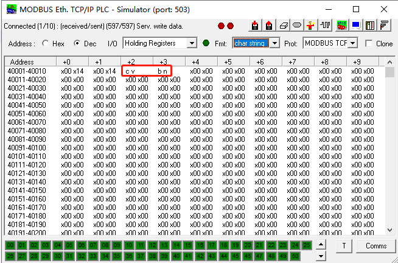

# Modbus Example

  - [Overview](#overview)
  - [Prerequisites](#prerequisites)
  - [Environment Preparation](#environment-preparation)
    - [Configuring the Modbus simulator](#configuring-the-modbus-simulator)
    - [Configuring the development environment](#configuring-the-development-environment)
  - [Verify data read and write](#test-procedure)

## Overview

Modbus is a serial communication protocol based on the master/slave architecture. It allows multiple devices to communicate with each other through the same network. Modbus has become an industry standard for industrial device communication and a commonly used method to connect industrial electronic devices. Modbus is more widely used than other communication protocols because of the following reasons:

1. Modbus is an open protocol and not copyrighted.
2. Modbus is easy to deploy and maintain.
3. Modbus allows suppliers to move bits or bytes of local data flexibly.

InHand Networks provides a `modbus` example to help you complete secondary development for Modbus data collection by using the InGateway. This example runs `modbus_tk` on the InGateway, so that the InGateway can act as a Modbus master to read and write variables of Modbus function codes 01, 02, 03, and 04 on a Modbus slave using the Modbus TCP and Modbus RTU protocols. The InGateway supports the following types of variables: bit, word, and string and so on. For details about how to use `modbus_tk`, see [modbus\_tk](https://github.com/ljean/modbus-tk/).  <font color=#FF0000>Caution: Do not run the `device_supervisor app` and `modbus example` at the same time, as doing so may cause exceptions in code execution.</font>

## Prerequisites

Before starting development and testing, ensure that the following items are ready:

- InGateway
  - Firmware version
    - IG902: `IG9-V2.0.0.r12644` or later (Contact the customer service to obtain the firmware file.)
    - IG501: `IG5-V2.0.0.r12884` or later (Contact the customer service to obtain the firmware file.)
  - Python3 SDK version
    - IG902: `py3sdk-V1.3.9_Edge-IG9` or later (Contact the customer service to obtain this SDK.)
    - IG501: `py3sdk-V1.3.9_Edge-IG5` or later (Contact the customer service to obtain this SDK.)
- VS Code software
- Modbus simulator software or Modbus PLC (This example uses Modbus simulator software `mod_RSsim`, which is available on https://sourceforge.net/projects/modrssim2/.)

## Environment Preparation

  - [Configuring the Modbus simulator](#configuring-the-modbus-simulator)
  - [Configuring the development environment](#configuring-the-development-environment)

### Configuring the Modbus simulator

Skip this section if you have configured the Modbus slave. The following procedure configures the Modbus simulator `mod_RSsim` on the PC for the subsequent test.

- Step 1: Set up a Modbus connection between the InGateway and your PC.
  
  - Modbus TCP: Use an Ethernet cable to connect the PC to the InGateway.  

    Set an IP address for the PC to make it in the same network segment as the InGateway. (For an IG501, the default IP address of interface FE 0/1 is `192.168.1.1`. For an IG902, the default IP address of interface GE 0/2 is `192.168.2.1`.)
    
    - Method 1: Enable the PC to obtain an IP address automatically (recommended).
      
      
    
    - Method 2: Use a fixed IP address.  

      Select **Use the following IP address**, specify the IP address, subnet mask, default gateway, and DNS server address, and then click **OK**. (In this example, the IP address of the PC is set to `192.168.2.10`.)
      
      
  
  - Modbus RTU: Use a USB-serial cable to connect the PC to the InGateway.  

    The following figure shows the serial port connection on an IG902.
    
    
    
    The following figure shows the serial port connection on an IG501.
    
    

- Step 2: Configure the `mod_RSsim` software.
  
  - Modbus TCP  

    Start the `mod_RSsim` software on the PC and select the `MODBUS TCP/IP` protocol for Modbus TCP communication with the Modbus master.
    
    
    
    Click **Comms** and set the TCP communication parameters. Here, the communication port number is set to `503`.
    
    
  
  - Modbus RTU  

    Start the `mod_RSsim` software on the PC and select the `MODBUS RS-232` protocol for Modbus RTU communication with the Modbus master (through the RS232 or RS485 serial port).
    
    
    
    Set the RTU communication parameters in consistence with the Modbus parameter settings in `modbus_example.py`. For details, see [Modifying parameters of the Modbus slave](#modify-the-code).
    
    

### Configuring the development environment

<a id="prepare-the-development-environment"> </a>

- Prepare the development environment  

  For details about how to connect the InGateway to the Internet, update the software, and obtain the IDE software, see [MobiusPi Python Development Quick Start](http://sdk.ig.inhandnetworks.com/en/latest/MobiusPi%20Python%20QuickStart-EN.html). The following operation instructions are provided based on the assumption that you have updated the InGateway software, connected the InGateway to the Internet, and enabled the debug mode.

<a id="create-project-folder"> </a>

- Creating a project folder  

  Create a project folder. The final structure of the project folder is as follows:
  
  ```
  ├── .vscode
  │  └── sftp.json
  ├── build
  ├── lib
  ├── src
  │  │── main.py
  │  └── modbus_example.py
  └── setup.py
  ```
  
  - `.vscode`: VS Code configuration folder.
    - `sftp.json`: SFTP configuration file that enables the PC to establish an SFTP connection to the InGateway.
  - `build`: app release package folder.
  - `lib`: folder of the app's third-party dependent library.
  - `src`: folder of the app's source code.
    - `main.py`: entry to the app.
    - `modbus_example.py`: runs `modbus_tk` on the InGateway, so that the InGateway can act as the Modbus master to read and write variables of Modbus function codes 01, 02, 03, and 04 on the Modbus slave using the Modbus TCP and Modbus RTU protocols.
  - `setup.py`: app description file.

<a id="test-procedure"> </a> 

## Verify data read and write

- [Installing modbus\_tk](#installation-modbus-tk)
- [Modifying parameters of the Modbus slave](#modify-the-code)
- [Debugging the code](#debug-code)
- [Checking data read or written on mod\_RSsim](#check-read-write-data-on-modrssim)

<a id="installation-modbus-tk"> </a>

- Step 1: Install `modbus_tk`.  

  Establish an SFTP connection to the InGateway. For details, see [Establishing an SFTP connection](http://sdk.ig.inhandnetworks.com/en/latest/MobiusPi%20Python%20QuickStart-EN.html#create-an-sftp-connection). After the SFTP connection is established, run `pip install modbus_tk --user` on the PC to install the `modbus_tk` dependent library.
  
  
  
  The following figure shows that the installation has succeeded.
  
  

<a id="modify-the-code"> </a>

- Step 2: Modify parameters of the Modbus slave.  

  The default settings of this example enable the InGateway to use the `Modbus TCP` protocol to collect the following variable data from the Modbus slave with the IP address `192.168.2.10`, port number `503`, and slave site address `1`, based on the byte order of `cdab` and timeout interval of `15` seconds:
  
  1. Read the `bit`-type Modbus data at register address `1`, and write the value `0` into the register address. The data name is `power`.
  2. Read the second bit of the `bit`-type Modbus data at register address `30001`. The data name is `model`.
  3. Read the `word`-type Modbus data at register address `40001`, and write the value `20` into the register address. The data name is `speed`.
  4. Read the `string`-type Modbus data at `4` register addresses starting from `40003`, and write the data sequentially into the string `cvbn`. The data name is `pressure`.
  
  You can use code of this example directly if you use the `mod_RSsim` simulator or the preceding Modbus address variables have been configured on your Modbus PLC. Otherwise, modify the configuration of the following variables in `modbus_example.py`:
  
  
  
  - `mbProto` (Modbus TCP)
    - `reconnect_interval`: timeout interval of the TCP connection
    - `hostname`: IP address of the Modbus simulator or PLC
    - `type`: communication type, which is `TCP` for Ethernet communication
    - `port`: communication port number
    - `slave`: slave address
    - `byte_order`: byte order, which can be `abcd`, `badc`, `cdab`, or `dcba`.
  - `mbProto` (Modbus RTU)
    - `type`: communication type, which is `RTU` for serial communication
    - `serialPort`: serial port ID, which is `/dev/tty03` for the RS485 port and `/dev/ttyO1` for the RS232 port
    - `baudrate`: baud rate
    - `bytesize`: data bits
    - `parity`: parity bit, which is `N` for no parity, `E` for even parity, and `O` for odd parity
    - `stopbits`: stop bit
    - `slave`: slave address
    - `byte_order`: byte order, which can be `abcd`, `badc`, `cdab`, or `dcba`
  - `mbVal`
    - `addr`: address of a Modbus register
    - `operation`: `rw` for the read/write operation, `ro` for the read-only operation, or `wo` for the write-only operation
    - `len`: length of the data read or written, valid only for the `string`-type data
    - `name`: data name
    - `data_type`: data type
    - `register_bit`: the specific bit of the register address to be read when the data of function codes 03 and 04 is of the `bit` or `bool` type. It can be any one of bits `0-15`.
    - `write_value`: the value to be written into the Modbus register address when data is writable

<a id="debug-code"> </a>

- Step 3: Debug the code.  

  For details about how to debug the code by using the VS Code software, see [Debugging code](http://sdk.ig.inhandnetworks.com/en/latest/MobiusPi%20Python%20QuickStart-EN.html#debug-the-code). The `main.py` execution result is shown in the following figure.
  
  

<a id="check-read-write-data-on-modrssim"> </a>

- Step 4: Check the data read or written on `mod_RSsim`.  

  Select `Coil Outputs` from the `I/O` drop-down list in the `mod_RSsim` window. Verify that the data value of register address `1` is 0, same as the data value of `power`.
  
  
  
  Select `Analogue Inputs` from the `I/O` drop-down list in the `mod_RSsim` window. Verify that the data value of the second bit of register address `30001` is 1, same as the data value of `model`.
  
  
  
  Select `Holding Registers` from the `I/O` drop-down list in the `mod_RSsim` window. Verify that the data value of the register address `40001` is 20, same as the data value written into `speed`.
  
  
  
  Select `char string` from the `Fmt` drop-down list in the `mod_RSsim` window. Verify that the data value of the register addresses `40003-40004` is cvbn, same as the data value written into `pressure`.
  
  

Now, development of the Modbus data collection on InGateway is completed.