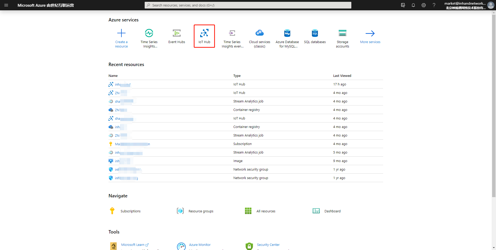
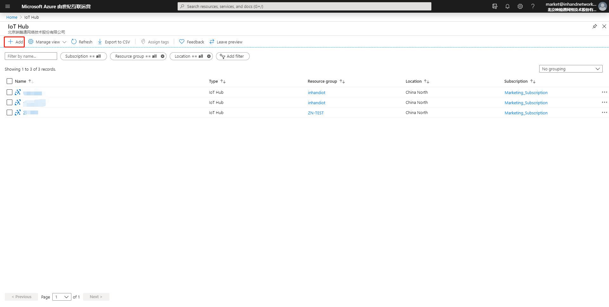
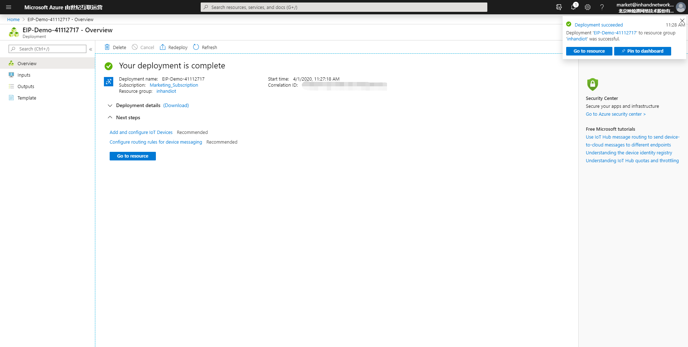

# EtherNet/IP to Azure IoT Hub Example

 - [Overview](#overview)
 - [Prerequisites](#prerequisites)
 - [Preparing the Environment](#preparing-the-environment)
 - [Starting the Test](#starting-the-test)

## Overview  
To allow you implement secondary development based on InGateway so as to upload data to the Azure IoT Hub and receive data from Azure IoT Hub, InHand provides the `azure_iot_device` examples. The example contains the following:   
- `azure_iot_device/iothub_client_example`：Based on `Azure IoT Device SDK`, this demo is mainly used to upload data to the Azure IoT Hub and receive data from Azure IoT Hub. For detailed usage of `Azure IoT Device SDK`, please visit [azure-iot-sdk-python](https://github.com/Azure/azure-iot-sdk-python/tree/master/azure-iot-device).  
- `azure_iot_device/iothub_client_cert`：It is the certificate script required to connect to the Azure IoT. You can directly use this demo without making any modification.  
- `azure_iot_device/sftp.json`：It is the sftp configuration file for connecting to InGateway.  

## Prerequisites 
Before starting development and tests, you need to get the following items ready:   
- InGateway  
  - Firmware version: `2.0.0.r12191` or later  
  - SDK version: `1.3.4` or later  
- VS Code  
- Azure IoT account

## Preparing the Environment  

  - [Configuring the Azure IoT](#configuring-the-azure-iot)  
  - [Configuring the Development Environment](#configuring-the-development-environment)  

### Configuring the Azure IoT
If you already configure the related IoT Hub and IoT device on the Azure IoT, skip this section.  
- Step 1: Log in to the Azure IoT.  
Visit <https://portal.azure.cn/> and log in to the Azure IoT.  

    

- Step 2: Add an IoT Hub.   
On the following page displayed after the successful login, select **IoT Hub**.  

    

  Click **Add** to add an IoT Hub.  

    

    

  The following page is displayed after the IoT Hub is added.  

    

- Step 3: Add an IoT device.  
On the IoT Hub, create an IoT device.  

    

    

    

  The following page is displayed after the IoT device is added.  

    
 
### Configuring the Development Environment  
- [Configuring the InGateway](#gateway-configuration)  
- [Creating a project folder](#create-project-folder)  
- [Installing the Azure IoT Tools plug-in in VS Code](#install-azure-iot-tools-plugin)  
- [Installing the Azure IoT SDK](#install-azure-iot-sdk)  

   

- Configuring the InGateway  
For details about basic configuration operations, such as connecting the InGateway to the Internet, updating the software, and obtaining the IDE software, see [MobiusPi Python Development Quick Start](http://doc.ig.inhandnetworks.com/en/latest/QuickStart.html). In the following operations, it is assumed that you have updated the InGateway software, connected the InGateway to the Internet, and enabled the debugging mode.  

  

- Creating a project folder  
Create a project folder named **Demo test**, and move `iothub_client_example.py`,`iothub_client_cert.py` and `sftp.json` downloaded from [InGateway-Python-Examples](https://github.com/inhandnet/InGateway-Python-Examples) to this folder.   

  

- Installing the Azure IoT Tools plug-in in VS Code  
In VS Code, click **Extensions**. Enter `Azure IoT Tools` in the search box and install the `Azure IoT Tools` plug-in.  

    

  After the successful installation, you can see the `Azure` module on the left.  

    

  

- Installing the Azure IoT SDK     
Open the project folder in VS Code. In the **Command Palette**, enter the `>SFTP:Config` command to open the `sftp.json` file.  

    

  Configure the `sftp.json` file. For details about the configuration method, see [Establish an SFTP Connection](http://doc.ig.inhandnetworks.com/en/latest/QuickStart.html#set-up-an-sftp-connection).  

    

  After completing and saving the configuration, enter `>SFTP:Open SSH in Terminal` in the **Command Palette** to connect to InGateway.  

    

  Then, you are requested to enter the IP address of the SFTP server, that is, the content on the **host** line.  
 
    

  In the **Terminal** window, you are requested to enter a password. You only need to copy the **password** from the `sftp.json` file, and paste it here.  

    

  The following page is displayed after an SFTP connection is successfully established with InGateway.   

    

In the Terminal window, enter the `pip install azure-iot-device --user` command to install the Azure IoT SDK.  

    

  The following page is displayed after the successful installation.  

    

## Starting the test  
- [Configuring iothub_client_example.py](#configuration-iothub-client-example)   
- [Using Azure IoT Tools to view the uploaded data](#view-uploaded-data)  
- [Using Azure IoT Tools to send data](#send-data)  

  

- Step 1: Configure `iothub_client_example.py`.  
In VS Code, open the project folder, select `iothub_client_example.py`, and modify `CONNECTION_STRING` in the script based on actual conditions.  

    

  

- Step 2: Use Azure IoT Tools to view the uploaded data.  
Establish SFTP connection with InGateway and run `iothub_client_example.py`.  

    

  On the **AZURE IOT HUB** module, set the IoT Hub connection string to establish a connection with IoT Hub.  

    
    
  Then, you are requested to enter **IoT Hub Connection String**.  

    

  You can copy the IoT Hub connection string from the **Azure IoT Hub** page.  

    

  After enter the IoT Hub connection string, you can see IoT Device under this IoT Hub, and its state is Connected.  

    

  Right-click IoT Device and choose `Start Monitoring Built-in Event Endpoint` to view the EIP data pushed from the InGateway to the IoT Hub.  

    

  Later, you can view the EIP data received by the IoT Hub in the **Output** window.  

    

  

- Step 3: Use Azure IoT Tools to send data.  
Right-click IoT Device and choose `Send C2D Message to Device` to send data to the InGateway.  

    

  In the **Enter message to send to device** text box, enter the data to be delivered. For example `{"temperature": 27,"humidity": 66}`. 

    

  If the following log is displayed in the **Output** window, the data is sent successfully.  

    

  Later, you can view the data received by the InGateway in the **Terminal** window.  

     

By now, you have uploaded data to the Azure IoT Hub and received data from Azure IoT Hub.

## FAQ
Q1: After the script runs for a while, the data cannot be uploaded to Azure IoT Hub.  
A1: Please check whether the connection to the Azure IoT Hub is normal. When the number of messages exceeds 8000, it may cause the data not to be uploaded normally.

