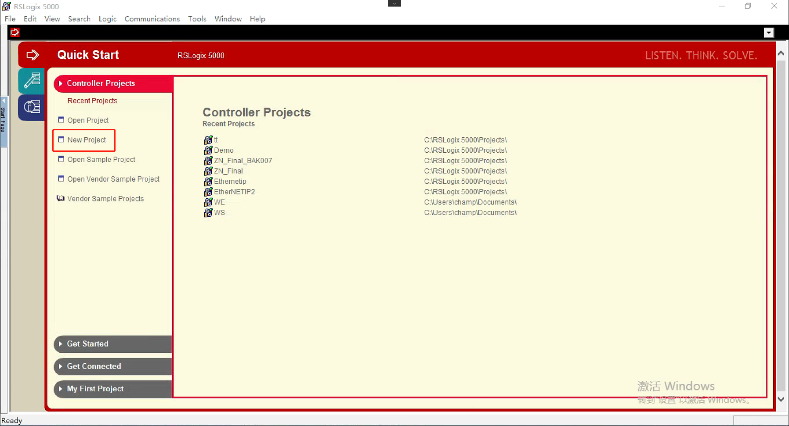
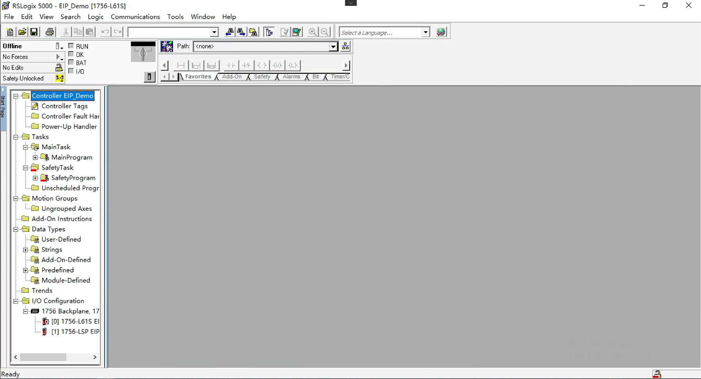
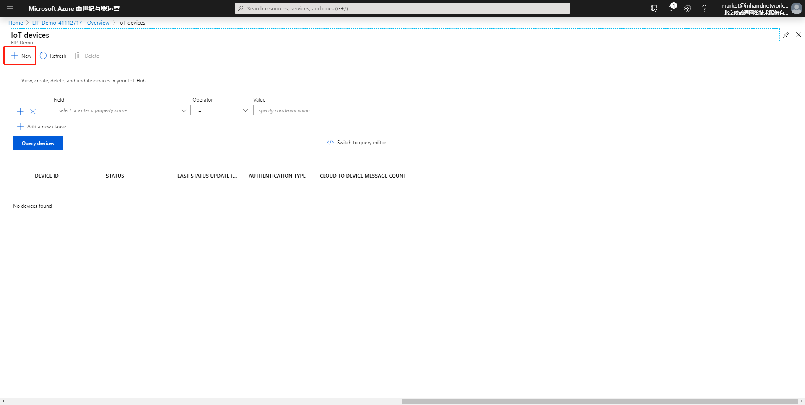
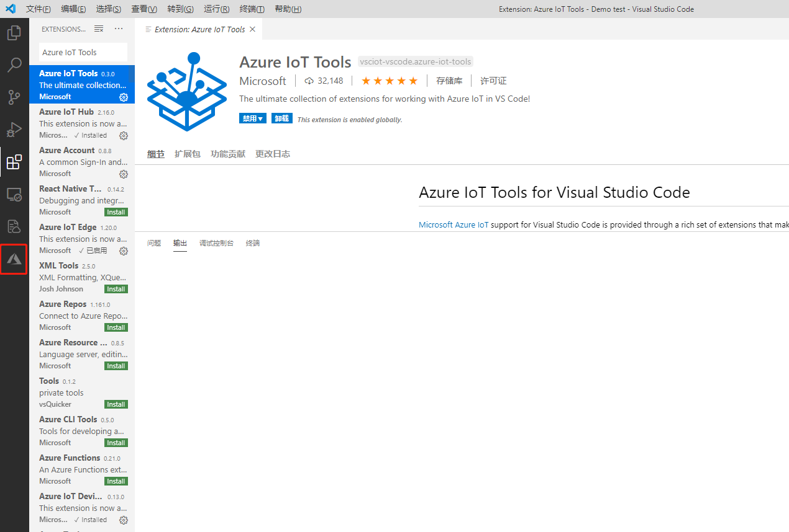
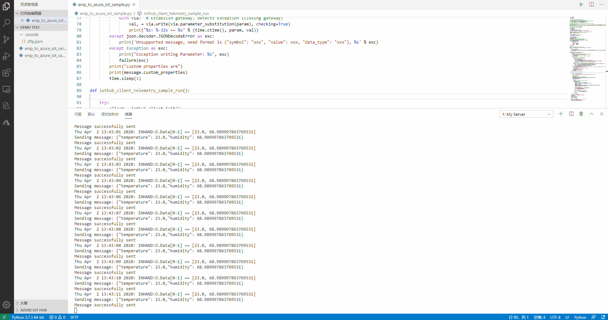

# EtherNet/IP to Azure IoT Hub Example

 - [概述](#概述)
 - [先决条件](#先决条件)
 - [环境准备](#环境准备)
 - [开始测试](#开始测试)

## 概述
EtherNet/IP（以下简称为EIP）是基于TCP/IP和通用工业协议（CIP）的工业以太网协议，采用标准的EtherNet和TCP／IP技术来传送CIP通信包，主要用于网络实时控制应用，通常情况下，使用星型拓扑结构。EIP支持在同一链路上完整实现设备组态（配置）、实时控制（控制）、信息采集（数据采集）等全部网络功能，具备以下特点：  
- EIP使用TCP传递显式消息，使用UDP传递隐式消息
- 通过基于用户数据报协议（UDP）的隐式消息传递基本I/O数据  
- 通过TCP（即显式消息传递）上载和下载参数，设定值，程序和配方  
- 通过UDP进行轮询，循环和状态更改监视    

为便于客户基于InGateway二次开发实现采集EIP数据并上传至Azure IoT Hub，映翰通提供以下三个demo示例（本文档主要对`enip_to_azure_iot_example`进行说明）：  
- `ethernetip/enip_cpppo_example`：通过EIP协议读写PLC数据  
- `azure_iot_device/iothub_client_example`：上传数据至Azure IoT Hub并接收Azure IoT Hub下发的数据  
- `ethernetip_to_azure_iot/enip_to_azure_iot_example`：采集EIP数据并上传Azure IoT Hub以及通过Azure IoT Hub远程修改EIP Scanner数据值。（即enip_cpppo_example和iothub_client_sample的整合版）  

`enip_to_azure_iot_example`的数据处理流程如下图所示：  

  

示例`enip_to_azure_iot_example`的接线拓扑如下所示:  

## 先决条件
在进行开发和测试前，你需要具备以下条件：  
- 硬件设备  
  - InGateway  
    - 固件版本：`2.0.0.r12191`及以上  
    - SDK版本：`1.3.4`及以上  
  - EtherNet/IP Scanner设备（本文档使用1756-L61S & 1756-ENET/B）以及EtherNet/IP adapter设备  
- 软件  
  - VS Code软件  
  - RSLogix 5000软件  
- Azure IoT账号  

## 环境准备

 - [配置EIP Scanner&Adapter](#配置eip-scanneradapter)  
 - [配置Azure IoT](#配置azure-iot)  
 - [配置开发环境](#配置开发环境)  
### 配置EIP Scanner&Adapter  
如果你已有搭建好的EIP Scanner和Adapters环境，可以跳过这一小节。
- 步骤1：新建项目  
打开电脑上的RSLogix 5000软件，单击“New Project”以建立一个新项目。  

    

  选择相应的PLC型号（本demo为1756-L61S）并配置项目名称；其余项使用默认配置即可。配置完成后点击“确定”。  

    

  项目添加成功后如下图所示：  

    

- 步骤2：配置EIP组态  
随后右击“Backplane”选择“New Module”添加以太网模块（本demo使用1756-ENET/B模块，IP地址为192.168.2.23）。该以太网模块以及1756-L61S组成EIP Scanner。  

    

  右击以太网模块并添加通用以太网模块，即EIP Adapter device（本demo使用ETHERNET-MODULE模块，IP地址为192.168.2.20）。  

    

  EIP Adapter添加完成后在“Controller Tags”中可以看到EIP Adapter模块映射的变量。  

    

- 步骤3：下载程序至PLC  
随后点击“Communications”将配置好的程序下载至PLC中。  

    

  程序下载后如果组态成功可看到I/O指示灯为绿色常亮的`I/O OK`状态。  

    

随后修改相应的变量数据用于后续测试读取和写入。至此，完成了通过RSLogix5000软件配置EIP Scanner & Adapter。  

  

### 配置Azure IoT
如果你已经在Azure IoT上配置了相应的IoT Hub和IoT device，可以跳过这一小节。
- 步骤1：登录Azure IoT  
访问<https://portal.azure.cn/>登录Azure。  

    

- 步骤2：添加IoT Hub  
登录成功后如下图所示，选择“IoT Hub”。  

    

  点击“Add”创建一个IoT Hub。  

    

    

  创建成功后如下图所示：  

    

- 步骤3: 添加IoT Device  
在IoT Hub中创建一个IoT Device。  

    

    

    

  创建成功后如下图所示：  

  

### 配置开发环境  
- [InGateway配置](#gateway-configuration)  
- [建立项目文件夹](#create-project-folder)  
- [在VS Code中安装Azure IoT Tools插件](#install-azure-iot-tools-plugin)  
- [安装cpppo](#install-cpppo)  
- [安装Azure IoT SDK](#install-azure-iot-sdk)  

   

- InGateway配置  
设备联网、软件更新、IDE软件获取等基础的配置操作请查看[MobiusPi Python Development Quick Start](http://doc.ig.inhand.com.cn/zh_CN/latest/QuickStart.html)。以下操作我们将假设你已经完成了InGateway的软件更新、设备联网、开启调试模式等配置。  

  

- 建立项目文件夹  
建立一个“Demo test”文件夹作为项目文件夹，将从[InGateway-Python-Examples](https://github.com/inhandnet/InGateway-Python-Examples)下载的`enip_to_azure_iot_example.py`和`enip_to_azure_iot_cert.py`放入项目文件夹中。  
  - `enip_to_azure_iot_example.py`：主要基于Ethernet/IP软件开发包`cpppo`和`Azure IoT Device SDK`实现采集EIP数据并上传Azure IoT Hub以及通过Azure IoT Hub远程修改EIP Scanner数据值。你只需要简单修改`enip_to_azure_iot_example.py`即可用于你的EIP Scanner进行测试。  
    - 软件开发包`cpppo`的详细使用方法请访问[cpppo](https://github.com/pjkundert/cpppo)。  
    - `Azure IoT Device SDK`的详细使用方法请访问[azure-iot-sdk-python](https://github.com/Azure/azure-iot-sdk-python/tree/master/azure-iot-device)。   
  - `enip_to_azure_iot_cert.py`：连接Azure IoT所需的证书脚本，直接使用即可，无需修改。  

  

- 在VS Code中安装Azure IoT Tools插件  
在VS Code中点击“Extensions”，在搜索框中输入`Azure IoT Tools`并安装`Azure IoT Tools`插件。  

    

  安装成功后在左侧可以看到`Azure`模块。  

    

 

- 安装`cpppo`  
使用VS Code打开项目文件夹，在“命令面板”中输入`>SFTP:Config` 命令快速创建或打开`sftp.json`文件用于建立与InGateway的SFTP连接。  

    

  配置`sftp.json`文件，配置方法见[建立SFTP连接](http://doc.ig.inhand.com.cn/zh_CN/latest/QuickStart.html#sftp)。  

    

  配置完成并保存后在“命令面板”中输入`>SFTP:Open SSH in Terminal`以连接InGateway。  

    

  输入后命令面板会提示你需要输入SFTP服务器的IP地址（即“host”项内容）。  

    

  “终端”窗口会提示你需要输入密码，你只需要将`sftp.json`文件中“password”项复制粘贴到此处即可。  

    

  成功与InGateway建立SFTP连接后如下图所示：  

    

  在“终端”中输入`pip install cpppo --user`命令以安装cpppo依赖库。(安装前请确认InGateway已经联网成功)  

    

  安装成功后如下图所示：  

  

 

- 安装Azure IoT SDK  
在“终端”中输入`pip install azure-iot-device --user`命令以安装Azure IoT SDK。  

    

  安装完成后如下图所示：  

    

## 开始测试  
- [配置enip_to_azure_iot_example.py](#configuration-enip-to-azure-iot-sample)  
- [本地采集EIP数据](#collect-eip-data-locally)  
- [使用Azure IoT Tools查看上报数据](#view-reported-data)  
- [使用Azure IoT Tools下发数据](#send-data)  

 

- 步骤1：配置`enip_to_azure_iot_example.py`  
在VS Code中打开项目文件夹并选中`enip_to_azure_iot_example.py`，根据你的实际情况修改脚本中的`CONNECTION_STRING`和`params`参数。  

    

- 步骤2：本地采集EIP数据   
与InGateway建立SFTP连接成功后，在左侧空白处右键选择“Sync Local->Remote”将代码同步到InGateway，同步成功后本地修改或者删除代码时都会自动和InGateway同步。  

    

  在“终端”窗口输入`cd /var/user/`进入`enip_to_azure_iot_example.py`所在的InGateway目录  

    

  执行`python enip_to_azure_iot_example.py 192.168.2.23`命令以运行脚本（192.168.2.23是EIP Scanner的IP地址）。  

    

  读取数据成功后如下图所示，与EIP Scanner的数据一致。  

    

    

- 步骤3：使用Azure IoT Tools查看上报数据  
在“AZURE IOT HUB”模块中设置IoT Hub的连接字符串以建立与IoT Hub的连接。  

    
    
  随后会提示你输入IoT Hub Connetion String（IoT Hub连接字符串）。  

    

  IoT Hub连接字符串可从“Azure IoT Hub”页面复制。  

    

  输入IoT Hub Connetion String后可以看到该IoT Hub下的“IoT Device”且状态为Connected。  

    

  右击“IoT Device”并在菜单中选择`Start Monitoring Built-in Event Endpoint`以查看InGateway推送到IoT Hub的EIP数据。  

    

  随后在“输出”窗口可以查看IoT Hub接收到的EIP数据。  

    

- 步骤4：使用Azure IoT Tools下发数据  
右击“IoT Device”并在菜单中选择`Send C2D Message to Device`以下发数据至InGateway。  

    

  在下发框中输入如下命令`{"symbol": "INHAND:O.Data[0]", "value": 22.6, "data_type": "REAL"}`（“symbol”为EIP数据标签；“value”为EIP数值；“data_type”为EIP数据类型）。  

    

  在“输出”窗口出现下图所示日志说明数据下发成功：  

    

  随后可在“终端”中查看InGateway接收到的下发数据。  

    

  同时，在EIP Scanner中可以看到INHAND:O.Data[0]的数值已被修改。  

    

至此，完成了采集EIP数据并上传Azure IoT Hub以及通过Azure IoT Hub远程修改EIP Scanner数据值。

## FAQ
Q1：脚本运行一段时间后，EIP数据无法上传至Azure IoT Hub了。  
A1：请检查与Azure IoT Hub的连接是否正常，当上报消息超过8000条时可能会导致无法正常上报数据。
