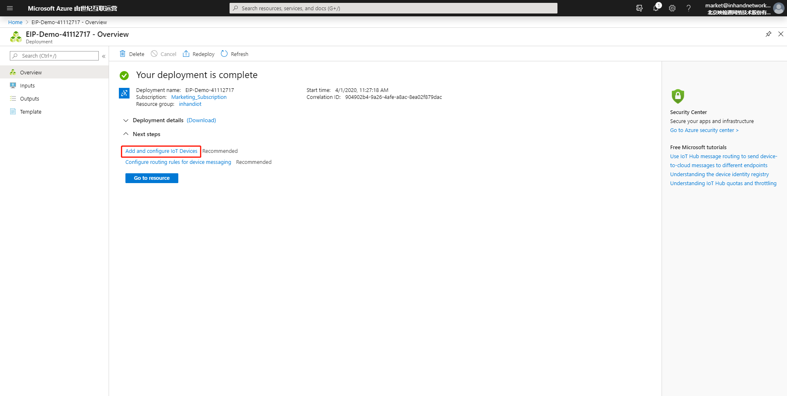
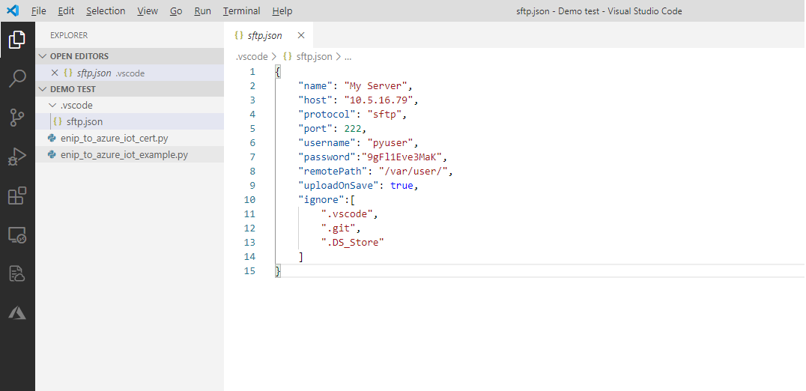
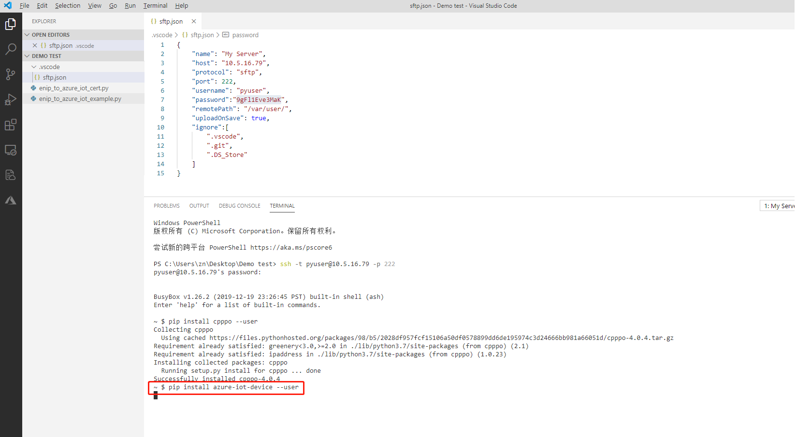

# EtherNet/IP to Azure IoT Example

 - [Overview](#overview)
 - [Prerequisites](#prerequisites)
 - [Preparing the Environment](#preparing-the-environment)
 - [Starting the Test](#starting-the-test)

## Overview  
EtherNet/IP (EIP) is an industrial Ethernet protocol based on TCP/IP and Common Industrial Protocol (CIP). It employs the standard Ethernet and TCP/IP technologies to transfer CIP communication packets, and is mainly used for real-time network control applications. A star topology is often used. EIP implements all network functions, such as device configuration, real-time control, and information collection, on the same link. EIP has the following features:   
- Transfers explicit messages over TCP, and implicit messages over UDP.   
- Transfers basic I/O data using User Datagram Protocol-based (UDP-based) implicit messages.   
- Uploads and downloads parameters, settings, programs, and formulas over TCP (that is, explicit message transfer).   
- Conducts polling, loop, and status change monitoring through UDP. 

To allow you implement secondary development based on InGateway so as to collect EIP data and upload data to the Azure cloud platform, InHand provides the following three demos (the demo `enip_to_azure_iot_sample` is mainly described in this document):   
- `enip_cpppo_example`：Used to read and write PLC data over EIP.  
- `iothub_client_sample`：Used to upload data to the Azure IoT and receive data from the Azure IoT.  
- `enip_to_azure_iot_sample`：Used to collect EIP data, upload the data to the Azure IoT, and remotely modify the EIP Scanner data value through the Azure IoT. That is, enip_to_azure_iot_sample integrates enip_cpppo_example with iothub_client_sample.   

The process topology of `enip_to_azure_iot_sample` is shown as follows:  

  

The connection topology of `enip_to_azure_iot_sample` is shown as follows:  

## Prerequisites 
Before starting development and tests, you need to get the following items ready:   
- Hardware  
  - InGateway  
    - InGateway firmware version: `2.0.0.r12191` or later  
    - InGateway SDK version: `1.3.4` or later  
  - EtherNet/IP Scanner (1756-L61S & 1756-ENET/B are used in this document) and EtherNet/IP adapter  
- Software  
  - VS Code  
  - RSLogix5000  
- Azure IoT account

## Preparing the Environment  

  - [Configuring the EIP Scanner & Adapter](#configuring-the-eip-scanner-adapter)  
  - [Configuring the Azure IoT](#configuring-the-azure-iot)  
  - [Configuring the Development Environment](#configuring-the-development-environment)  

### Configuring the EIP Scanner & Adapter  
If you already build the EIP Scanner & Adapter environment, skip this section.
- Step 1: Create a project.  
Start the RSLogix5000 software on your computer, and click **New Project** to create a project.  

    

  Select the corresponding PLC model (1756-L61S for this demo), specify the project name, and retain default settings for other parameters. After completing the settings, click **OK**.  

    
  
  The following page is displayed after the project is created.  

    

- Step 2: Complete the EIP configuration.   
Right-click **Backplane** and choose **New Module** to add an Ethernet module. In this demo, the 1756-ENET/B module is used, and its IP address is 192.168.2.23. This Ethernet module and 1756-L61S together constitute EIP Scanner.   

    

  Right-click the Ethernet module, and add an Generic Ethernet module, that is, the EIP Adapter device. In this demo, ETHERNET-MODULE is used, and its IP address is 192.168.2.20.  

    

  After adding EIP Adapter, you can see the variables mapped to EIP Adapter in the **Controller Tags** window.  

    

- Step 3: Download the program to the PLC.  
Click **Communications** to download the configured program to the PLC.  

    

  After the program is downloaded, if the configuration succeeds, the I/O indicator is constantly on in green, and is in `I/O OK` state.  

    

Modify the related variables for the read/write operations in the subsequent test. By now, configuration of EIP Scanner & Adapter is completed on RSLogix5000.  

  
  
### Configuring the Azure IoT
If you already configure the related IoT Hub and IoT device on the Azure IoT, skip this section.  
- Step 1: Log in to the Azure IoT.  
Visit <https://portal.azure.cn/> and log in to the Azure IoT.  

    

- Step 2: Add an IoT Hub.   
On the following page displayed after the successful login, select **IoT Hub**.  

    

  Click **Add** to add an IoT Hub.  

    

    

  The following page is displayed after the IoT Hub is added.  

    

- Step 3: Add an IoT device.  
On the IoT Hub, create an IoT device.  

    

    

    

  The following page is displayed after the IoT device is added.  

    
 
### Configuring the Development Environment  
- [Configuring the InGateway](#gateway-configuration)  
- [Creating a project folder](#create-project-folder)  
- [Installing the Azure IoT Tools plug-in in VS Code](#install-azure-iot-tools-plugin)  
- [Installing cpppo](#install-cpppo)  
- [Installing the Azure IoT SDK](#install-azure-iot-sdk)  

   

- Configuring the InGateway  
For details about basic configuration operations, such as connecting the InGateway to the Internet, updating the software, and obtaining the IDE software, see [MobiusPi Python Development Quick Start](http://doc.ig.inhand.com.cn/zh_CN/latest/QuickStart.html). In the following operations, it is assumed that you have updated the InGateway software, connected the InGateway to the Internet, and enabled the debugging mode.  

  

- Creating a project folder  
Create a project folder named **Demo test**, and move `enip_to_azure_iot_sample.py` and `enip_to_azure_iot_cert.py` downloaded from [Python-Demo](https://github.com/inhandnet/Python-Demo) to this folder.   
  - `enip_to_azure_iot_sample.py`：Based on Ethernet/IP software development kits `cpppo` and `Azure IoT Python SDK`, this demo is mainly used to collect EIP data, upload the data to the Azure IoT, and remotely modify the EIP Scanner data value through the Azure IoT. You only need to make some simple modifications to use `enip_to_azure_iot_sample.py` in your EIP Scanner for testing.   
  - `enip_to_azure_iot_cert.py`：It is the certificate script required to connect to the Azure IoT. You can directly use this demo without making any modification.  

  

- Installing the Azure IoT Tools plug-in in VS Code  
In VS Code, click **Extensions**. Enter `Azure IoT Tools` in the search box and install the `Azure IoT Tools` plug-in.  

    

  After the successful installation, you can see the `Azure` module on the left.  

    

  

- Installing `cpppo`   
Open the project folder in VS Code. In the **Command Palette**, enter the `>SFTP:Config` command to quickly create the `sftp.json` file, which is used to establish an SFTP connection with InGateway.  

    

  Configure the `sftp.json` file. For details about the configuration method, see [Establish an SFTP Connection](http://doc.ig.inhand.com.cn/zh_CN/latest/QuickStart.html#sftp).  

    

  After completing and saving the configuration, enter `>SFTP:Open SSH in Terminal` in the **Command Palette** to connect to InGateway.  

    

  Then, you are requested to enter the IP address of the SFTP server, that is, the content on the **host** line.  
 
    

  In the **Terminal** window, you are requested to enter a password. You only need to copy the **password** from the `sftp.json` file, and paste it here.  

    

  The following page is displayed after an SFTP connection is successfully established with InGateway.   

    

  In the Terminal window, enter the `pip install cpppo --user` command to install the cpppo dependency library. (Before installing the cpppo dependency library, check that InGateway has been connected to the Internet.)  

    

  The following page is displayed after the successful installation.  

    

  

- Installing the Azure IoT SDK  
In the Terminal window, enter the `pip install azure-iot-device --user` command to install the Azure IoT SDK.  

    

  The following page is displayed after the successful installation.  

    

## Starting the test  
- [Configuring enip_to_azure_iot_sample.py](#configuration-enip-to-azure-iot-sample)  
- [Collecting the EIP data locally](#collect-eip-data-locally)  
- [Using Azure IoT Tools to view the uploaded data](#view-uploaded-data)  
- [Using Azure IoT Tools to send data](#send-data)  

  

- Step 1: Configure `enip_to_azure_iot_sample.py`.  
In VS Code, open the project folder, select `enip_to_azure_iot_sample.py`, and modify `CONNECTION_STRING` and `params` in the script based on actual conditions.  

    

  

- Step 2: Collect the EIP data locally.   
After the SFTP connection is successfully established with InGateway, right-click in the blank space on the left and choose **Sync-Local-> Remote** to synchronize the code to InGateway. After the successful synchronization, changes will be automatically synchronized to InGateway when you modify or delete code locally.  
 
    

  In the Terminal window, enter `cd /var/user` to access the InGateway directory where `enip_to_azure_iot_sample.py` is located.  
 
    

  Execute the `python enip_to_azure_iot_sample.py 192.168.2.23` command to run the script, where 192.168.2.23 is the IP address of EIP Scanner.  

    

  After the data is successfully collect, the following page is displayed. Data on this page is consistent with that of EIP Scanner.  

    

    

  

- Step 3: Use Azure IoT Tools to view the uploaded data.  
On the **AZURE IOT HUB** module, set the IoT Hub connection string to establish a connection with IoT Hub.  

    
    
  Then, you are requested to enter **IoT Hub Connection String**.  

    

  You can copy the IoT Hub connection string from the **Azure IoT Hub** page.  

    

  After enter the IoT Hub connection string, you can see IoT Device under this IoT Hub, and its state is Connected.  

    

  Right-click IoT Device and choose `Start Monitoring Built-in Event Endpoint` to view the EIP data pushed from the InGateway to the IoT Hub.  

    

  Later, you can view the EIP data received by the IoT Hub in the **Output** window.  

    

  

- Step 4: Use Azure IoT Tools to send data.  
Right-click IoT Device and choose `Send C2D Message to Device` to send data to the InGateway.  

    

  In the **Enter message to send to device** text box, enter `{"symbol": "INHAND:O.Data[0]", "value": 22.6, "data_type": "REAL"}`, where **symbol** is the EIP data tag, **value** is the EIP data value, and **data_type** is the EIP data type.  

    

  If the following log is displayed in the **Output** window, the data is sent successfully.  

    

  Later, you can view the data received by the InGateway in the **Terminal** window.  

    

  In addition, you can see in EIP Scanner that the value of INHAND:O.Data[0] is already modified.  

    

By now, you have collected and uploaded the EIP data to the Azure IoT, and remotely modified the EIP Scanner value through the Azure IoT.

